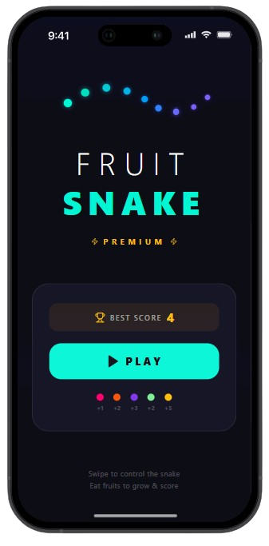

# 🐍 Fruit Snake - Mobile Game

A modern, vibrant, premium take on the classic Snake game for mobile devices. Navigate your glowing snake, eat various fruits to rack up points, and compete to beat your high score!

## ✨ Features

* **Intuitive Controls:** Simple swipe gestures to control the snake's direction.
* **Vibrant Neon UI:** A beautiful dark-themed interface with glowing, color-coded elements.
* **Dynamic Scoring:** Different fruits offer different point values, adding a layer of strategy.
* **High Score Tracking:** Automatically saves and displays your best run.
* **Pause/Resume:** Easily pause the gameplay whenever you need a break.

## 🎮 How to Play

1. Tap **PLAY** on the home screen to start.
2. **Swipe** up, down, left, or right anywhere on the screen to change the snake's direction.
3. Guide the snake to eat the colored fruits appearing on the screen.
4. Each fruit eaten makes the snake grow longer and increases your score.
5. *Don't hit the walls or your own tail!*

## 🍓 Scoring System

Different fruits will give you different point boosts. Be on the lookout for the rare ones!

* 🔴 **Pink Fruit:** +1 point
* 🟠 **Orange Fruit:** +2 points
* 🟢 **Green Fruit:** +2 points
* 🟣 **Purple Fruit:** +3 points
* 🟡 **Yellow Fruit:** +5 points

## 📱 Screenshots

<div align="center">
  
  
</div>

## 🛠️ Tech Stack

* **Framework:** React Native
* **Language:** JavaScript, TypeScript

## 🚀 Installation & Running Locally

To get a local copy up and running, follow these steps:

1. Clone the repository:
   ```bash
   git clone [https://github.com/PollaJoseph/fruit-snake.git](https://github.com/PollaJoseph/fruit-snake.git)
